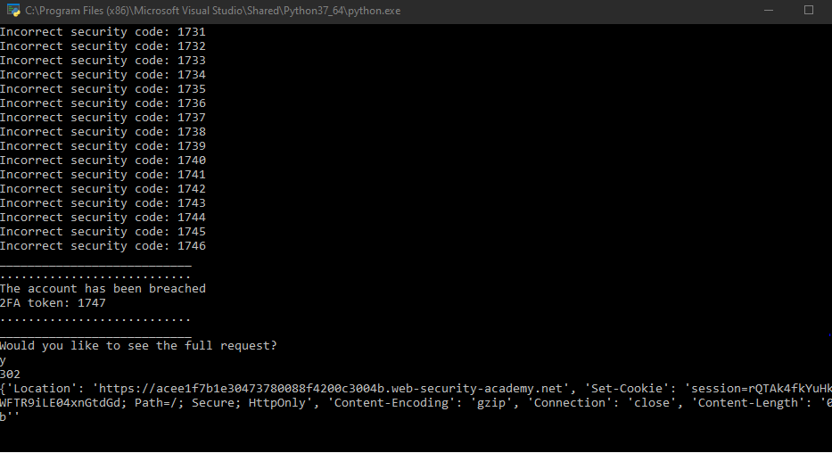

# Burp Intruder Python Alternative

This is a repo that contains Python scripts that are alternatives to Burp Intruder. 

## Username Enumeration Script Via Account Lock

In this script, you will have to change the URL, session cookie, and the CSRF parameter to fit your needs. You can also edit the dict list. That list is all the usernames that the script will try 10 times each. Then you can just run it. This script is necessary as an alternative to Burp Suite because I do not have Coumminity version and the Intruder is very throttled. It works by sending all the usernames in a list 10 times each and alerts you when you have found the username that gets locked out. This script us built to the enumerate usernames on the Portswiggers Web Academy Username Enumeration via Account Lock lab which only locks out valid usernames.

Here is a screenshot of it working:

## Password Brute Force Scirpt 

This is a script that will brute force password but avoid the lockout policy. As with th other scirpt, you will need to change the URL, session cookie, and the CSRF paramter to fit your needs. Then you should be able to run it. This script is a necesary alternative to Burp Intruder because it is able to aviod locking out the account. If you just send the requests through Burp Intruder, the account will get locked out and you will not be able to tell if the password is correct. This script us built to brute force passwords on the Portswiggers Web Academy Username Enumeration via Account Lock lab which has a 60 second lockout after every 3 requests.

Here is a screenshot of it working:

## 2FA Brute force Script

This is a script that is used the brute force 2FA tokens. you will have to change the URL, session cookie, and the CSRF parameter to fit your needs. Then you should be able to run it. This script is a necessary alternative to Brup Intruder because if you do not have Burp Pro, the Intruder is throttled to the point where you cannot even send 400 requests in 5 hours. In this application, you are required to send up to 10,000. This script is used to brute force the 2FA token on the Portswiggers Wbe Academy 2FA Broken Logic Lab. 

Here is a screenshot of it working:

