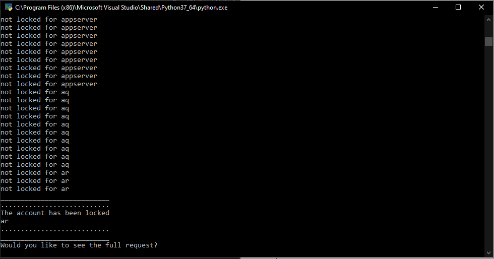
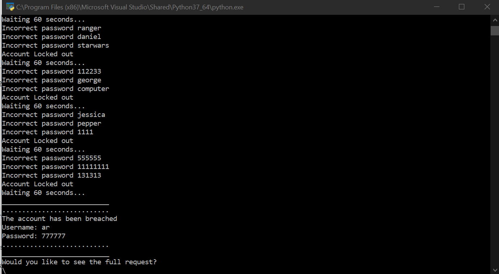

# Burp Intruder Python Alternative

This is a repo that contains Python scripts that are alternatives to Burp Intruder. This is necessary because there are some functions that it does not have and it is very throttled id you don't have the Pro version. The scripts are built to the test Portswiggers Web Academy Username Enumeration via Account Lock lab. 

## Username Enumeration Script Via Account Lock

In this script, you will have to change the URL, session cookie, and the CARF parameter to fit your needs. You can also edit the dict list. That list is all the usernames that the script will try 10 times each. Then you can just run it. 

Here is a screenshot of it working:

## Password Brute Force Scirpt 

This is a script that will brute force password but avoid the lockout policy. As with th other scirpt, you will need to change the URL, session cookie, and the CSRF paramter to fit your needs. Then you should be able to run it.

Here is a screenshot of it working:

## 2FA Brute force Script

This script is basically the same as all the others.

